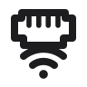
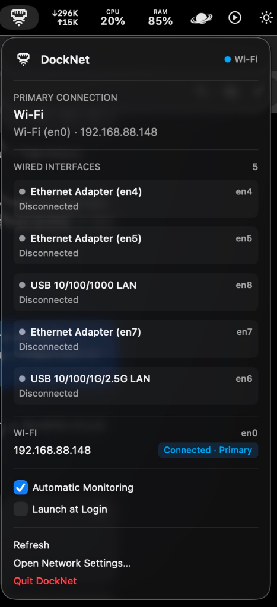

# DockNet

<p align="center">
  
</p>

<p align="center">
  A tiny macOS menu bar utility for seamless Ethernet and Wi-Fi failover.
</p>

---

If you're like me and dock at a place where there is hardwired Ethernet, but then are on Wi-Fi when moving around an office or space, it's annoying to change the enabled/disabled status of connections. DockNet solves this by monitoring for hardwired connections, preferring these, and then switching back over to Wi-Fi when they are no longer connected.

DockNet keeps an eye on your Mac's physical network connection and makes it easy to see what's actually being used.

Plug into Ethernet and macOS can prefer the wired connection. Unplug it and Wi-Fi is already connected and ready to take over. DockNet simply watches that process and tells you what happened.

## What it does

DockNet lives quietly in the macOS menu bar and shows your current physical network connection. It supports multiple Ethernet adapters, including USB, Thunderbolt docks, and Ethernet built into monitors.

When Ethernet is connected and healthy, DockNet reports it as the primary connection. If Ethernet disappears or cannot obtain a usable network configuration, Wi-Fi remains available as the fallback.

Optional macOS notifications can let you know when the physical connection changes.

<p align="center">
  
</p>

### Example

**Docked**

> Ethernet · en6  
> 192.168.88.160  
> Ready · Primary  

**Undocked**

> Wi-Fi · en0  
> 192.168.88.148  
> Connected · Primary  

Wi-Fi stays associated while Ethernet is in use, allowing macOS to fail over quickly when a cable or dock is disconnected.

## VPNs and Tailscale

DockNet intentionally ignores VPN and tunnel interfaces. Tailscale, VPN clients, exit nodes, and `utun` interfaces are overlays on top of your physical connection. DockNet continues to report the underlying Ethernet or Wi-Fi connection and leaves VPN software completely alone.

VPN connection changes do not generate DockNet notifications.

## Notifications

Connection notifications are optional. When enabled, DockNet can show a macOS banner when the physical connection changes, for example:

> **Switched to Ethernet**  
> USB 10/100/1G/2.5G LAN · en6  

or:

> **Switched to Wi-Fi**  
> Using en0 · 192.168.88.148  

DockNet does not notify simply because a VPN connects or disconnects.

## Philosophy

DockNet does not try to replace macOS networking. It does not disable Wi-Fi, rewrite routes, manage your VPN, or run a privileged network daemon.

macOS handles the actual routing and failover. DockNet observes the result and makes it visible.

## Installation

### Downloading a release

Download the latest pre-built universal DMG (`DockNet-<version>-macOS-universal.dmg`) and its SHA-256 checksum from [GitHub Releases](https://github.com/andrewtryder/docknet/releases).

Release builds are:
- **ad-hoc signed**
- **not Developer ID signed**
- **not notarized by Apple**

Because DockNet is an independent, non-notarized open-source project, macOS Gatekeeper may display a security prompt when opening the application for the first time.

To launch DockNet using standard macOS controls:

1. Attempt to open `DockNet.app`.
2. Open **System Settings -> Privacy & Security**.
3. Scroll down to find the message stating DockNet was blocked.
4. Click **Open Anyway**.
5. Confirm **Open** when prompted.

Users who prefer not to bypass Gatekeeper can clone the repository and build DockNet locally from source.

## Building from source

DockNet is a native Swift macOS application. You will need:

- macOS
- Xcode
- Apple's `xcodebuild` command-line tools

Clone the repository:

```bash
git clone https://github.com/andrewtryder/docknet.git
cd docknet
```

Build:

```bash
make build
```

Run the tests:

```bash
make test-all
```

Install the local build:

```bash
make install
```

Launch it:

```bash
make run
```

DockNet installs to:

```text
~/Applications/DockNet.app
```

The Xcode project is checked into the repository, so XcodeGen is not required for normal builds.

If you want the optional development tools:

```bash
brew bundle
```

### Signing

DockNet is currently an independent, unsigned/not-notarized project.

Local builds use ad-hoc signing and do not require an Apple Developer Program membership or Developer ID certificate.

Because published builds are not notarized by Apple, macOS may display a security warning when opening a downloaded build. If you prefer, clone the source and build DockNet locally using the instructions above.

## About

DockNet was created by **Andrew Ryder**.

[View DockNet on GitHub](https://github.com/andrewtryder/docknet)

<p align="center">
  <em>Ethernet when it's there. Wi-Fi when it isn't.</em>
</p>
